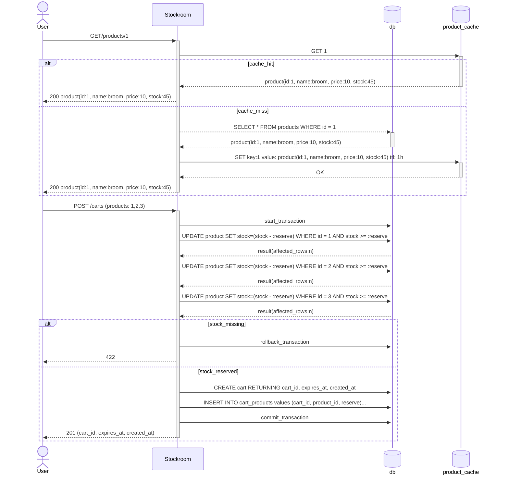

# Practice API: E-commerce Stock management

Tech stack:

- node
- typescript
- postgres
- bull-mq
- redis
- docker compose

## Infra checklist
- [x] Postgres database
  - [x] Staging: persistent
  - [x] Test: ephemeral
- [ ] Redis server

## Tools & Libs checklist

- [x] Http Routing: express;
- [x] Formatting: biome;
- [x] Unit Testing: vitest;
- [x] E2E testing: supertest (with vitest)
- [x] Database: kysely
- [x] Database migrations: kysely
- [x] Env vars: dotenv
- [ ] Schema validation: zod
- [ ] Caching: cache-manager

# Requirements

## **Project: BoltStore Flash Sale API**

**Objective:** Build a resilient, high-performance API capable of handling a massive surge of users competing for limited inventory during a 60-second window.

### **1. Core Functional Requirements**

* **User Management:**
* Users must be able to register and log in.
* System must support "Session Invalidation" (logging out from all devices) to prevent account sharing during sales.

* **Product Catalog:**
* Products must have a `stock_count` and a `sale_start_time`.
* Products should not be purchasable before their `sale_start_time`.

* **The "Flash" Checkout Flow:**
* **Cart Locking:** When a user "adds to cart," the item is reserved for **5 minutes**. If they don't check out, the stock returns to the pool.
* **Atomic Transactions:** A user should never be able to buy an item if the "Available Stock" (Total - Sold - Active Reservations) is zero.
* **Idempotency:** If a user clicks "Buy" twice due to lag, they should only be charged and assigned one item.

### **2. Technical & Performance Requirements**

* **Database (Postgres):**
* Implement a complex view or query to calculate "Real-time Available Inventory" that accounts for both completed sales and unexpired reservations.
* Ensure the database remains consistent under a simulated load of 100 concurrent write requests.

* **Caching (Redis):**
* The `GET /products` and `GET /products/:id` endpoints must serve data from a cache.
* Inventory counts must be synced between the cache and the database to prevent "Cache Stampedes" (where everyone hits the DB because the cache expired at the same time).

* **Asynchronous Processing (Queues):**
* The API must return a `202 Accepted` immediately after a successful payment capture.
* The following must happen in the background:
* **Stock Reconciliation:** Finalize the stock deduction.
* **Invoice Generation:** Create a digital receipt (simulated delay of 2 seconds).
* **Notification:** Push a "Success" message to a mock notification service.

* **Observability:**
* **Structured Logging:** Every request must be traceable via a unique ID across the application logs and database query logs.
* **Performance Metrics:** The API must expose or log "Time to First Byte" (TTFB) and "Database Query Execution Time."

### **3. Success Criteria (The "Test Suite")**

To consider this project "done," you should be able to prove:

1. **Zero Overselling:** If you have 10 items and 100 people click "Buy" at the same millisecond, exactly 10 orders are created.
2. **Sub-100ms Latency:** The product listing page loads in under 100ms even when the database is under load.
3. **Ghost Stock Recovery:** If a user reserves an item but closes their browser, that item becomes available to someone else exactly 5 minutes later without manual intervention.

### Solution

#### Add Product To Cart

